# Database Schema

Dokumen ini merangkum tabel pada `src/db/schema.ts`, termasuk struktur field, key, index, dan relasi antar tabel.

## 1. Ringkasan Modul
- `roles`, `permissions`, `role_permissions` untuk kontrol akses.
- `units`, `badan_hukums`, `users` untuk struktur organisasi dan akun.
- `assets` beserta tabel detail per jenis aset.
- `tax_depreciation_groups`, `tax_depreciation_rules`, `tax_asset_depreciation`, `tax_asset_coretax` untuk modul pajak.
- `audit_logs` untuk jejak aktivitas.

## 2. Diagram Relasi

```mermaid
erDiagram
  ROLES ||--o{ USERS : has
  ROLES ||--o{ ROLE_PERMISSIONS : grants
  PERMISSIONS ||--o{ ROLE_PERMISSIONS : maps

  UNITS ||--o{ UNITS : parent_of
  UNITS ||--o{ USERS : has
  BADAN_HUKUMS ||--o{ USERS : has

  UNITS ||--o{ ASSETS : manages
  BADAN_HUKUMS ||--o{ ASSETS : owns
  ASSETS ||--o{ ASSET_ATTACHMENTS : has
  ASSETS ||--o{ ASSET_ORGANIZATIONS : has
  UNITS ||--o{ ASSET_ORGANIZATIONS : related_unit
  BADAN_HUKUMS ||--o{ ASSET_ORGANIZATIONS : related_badan_hukum
  USERS ||--o{ ASSET_ORGANIZATIONS : related_user

  ASSETS ||--|| ASSET_LAND_DETAILS : land_detail
  ASSETS ||--|| ASSET_BUILDING_DETAILS : building_detail
  ASSETS ||--o{ ASSET_BUILDING_LANDS : building_link
  ASSETS ||--o{ ASSET_BUILDING_LANDS : land_link
  ASSETS ||--|| ASSET_VEHICLE_DETAILS : vehicle_detail
  ASSETS ||--|| ASSET_ITEM_DETAILS : item_detail
  ASSETS ||--|| TAX_ASSET_CORETAX : coretax_detail

  TAX_DEPRECIATION_GROUPS ||--o{ TAX_DEPRECIATION_RULES : has
  TAX_DEPRECIATION_GROUPS ||--o{ TAX_ASSET_DEPRECIATION : used_by
  TAX_DEPRECIATION_RULES ||--o{ TAX_ASSET_DEPRECIATION : selected_rule
  ASSETS ||--o{ TAX_ASSET_DEPRECIATION : depreciated

  USERS ||--o{ AUDIT_LOGS : actor
```

## 3. Tabel

### 3.1 roles
Master role untuk akses aplikasi.

| Field | Tipe | Constraint | Keterangan |
|---|---|---|---|
| id | uuid | PK | default random |
| code | varchar(64) | unique, not null | kode role |
| name | varchar(120) | not null | nama role |
| description | text | nullable | deskripsi |
| is_system | boolean | not null, default false | role bawaan sistem |
| created_at | timestamp with timezone | not null, default now | waktu dibuat |
| updated_at | timestamp with timezone | not null, default now | waktu diubah |

Index:
- `roles_code_idx`

### 3.2 permissions
Master permission untuk kontrol akses berbasis resource dan action.

| Field | Tipe | Constraint | Keterangan |
|---|---|---|---|
| id | uuid | PK | default random |
| code | varchar(96) | unique, not null | kode permission |
| resource | varchar(64) | not null | nama resource |
| action | varchar(64) | not null | aksi |
| description | text | nullable | deskripsi |
| created_at | timestamp with timezone | not null, default now | waktu dibuat |
| updated_at | timestamp with timezone | not null, default now | waktu diubah |

Index:
- `permissions_code_idx`

### 3.3 role_permissions
Tabel pivot many-to-many antara role dan permission.

| Field | Tipe | Constraint | Keterangan |
|---|---|---|---|
| role_id | uuid | PK part, FK -> roles.id, cascade | role |
| permission_id | uuid | PK part, FK -> permissions.id, cascade | permission |
| granted | boolean | not null, default true | status grant |
| created_at | timestamp with timezone | not null, default now | waktu dibuat |

Primary key:
- `(role_id, permission_id)`

### 3.4 units
Struktur unit organisasi.

| Field | Tipe | Constraint | Keterangan |
|---|---|---|---|
| id | uuid | PK | default random |
| code | varchar(64) | unique, not null | kode unit |
| name | varchar(160) | not null | nama unit |
| kind | varchar(32) | not null | jenis unit |
| category | varchar(64) | nullable | kategori unit |
| parent_id | uuid | FK -> units.id, set null | parent hierarki |
| legal_parent_type | varchar(64) | nullable | jenis parent legal |
| legal_parent_unit_id | uuid | FK -> units.id, set null | parent unit legal |
| legal_parent_badan_hukum_id | uuid | nullable | referensi legal badan hukum, tanpa FK eksplisit |
| legal_parent_label | varchar(191) | nullable | label parent legal |
| address | text | nullable | alamat |
| responsible_person | varchar(160) | nullable | penanggung jawab |
| notes | text | nullable | catatan |
| created_at | timestamp with timezone | not null, default now | waktu dibuat |
| updated_at | timestamp with timezone | not null, default now | waktu diubah |

Index:
- `units_code_idx`

Catatan relasi:
- `parent_id` membentuk hierarki unit.
- `legal_parent_unit_id` adalah relasi legal tambahan, terpisah dari parent struktural.

### 3.5 badan_hukums
Master badan hukum.

| Field | Tipe | Constraint | Keterangan |
|---|---|---|---|
| id | uuid | PK | default random |
| name | varchar(160) | not null | nama badan hukum |
| type | varchar(32) | not null | jenis badan hukum |
| field | varchar(32) | not null | bidang |
| legal_basis | text | nullable | dasar hukum |
| kemenkumham_number | varchar(100) | nullable | nomor SK |
| established_at | date | nullable | tanggal berdiri |
| representative | varchar(160) | nullable | wakil/pengurus |
| status | varchar(64) | nullable | status terkini |
| notes | text | nullable | catatan |
| created_at | timestamp with timezone | not null, default now | waktu dibuat |
| updated_at | timestamp with timezone | not null, default now | waktu diubah |

Index:
- `badan_hukums_name_idx`

### 3.6 users
Akun pengguna aplikasi.

| Field | Tipe | Constraint | Keterangan |
|---|---|---|---|
| id | uuid | PK | default random |
| name | varchar(160) | not null | nama pengguna |
| email | varchar(191) | unique, not null | email login |
| password_hash | text | not null | hash password |
| role_id | uuid | FK -> roles.id, restrict | role pengguna |
| unit_id | uuid | FK -> units.id, set null | unit pengguna |
| badan_hukum_id | uuid | FK -> badan_hukums.id, set null | badan hukum pengguna |
| is_active | boolean | not null, default true | status aktif |
| last_login_at | timestamp with timezone | nullable | login terakhir |
| created_at | timestamp with timezone | not null, default now | waktu dibuat |
| updated_at | timestamp with timezone | not null, default now | waktu diubah |

Index:
- `users_email_idx`

### 3.7 assets
Tabel utama aset.

| Field | Tipe | Constraint | Keterangan |
|---|---|---|---|
| id | uuid | PK | default random |
| code | varchar(64) | unique, not null | kode aset |
| name | varchar(191) | not null | nama aset |
| asset_type | varchar(32) | not null | jenis aset |
| ownership_level | varchar(32) | not null | level kepemilikan |
| unit_id | uuid | FK -> units.id, set null | unit pengelola |
| badan_hukum_id | uuid | FK -> badan_hukums.id, set null | badan hukum pemilik/pengelola |
| acquisition_date | date | nullable | tanggal perolehan |
| acquisition_value | numeric(18,2) | nullable | nilai perolehan |
| legal_status | varchar(64) | nullable | status legalitas |
| owner_name | varchar(191) | nullable | nama pemilik |
| condition | varchar(64) | nullable | kondisi aset |
| status | varchar(32) | not null, default active | status aset |
| notes | text | nullable | catatan |
| created_at | timestamp with timezone | not null, default now | waktu dibuat |
| updated_at | timestamp with timezone | not null, default now | waktu diubah |

Index:
- `assets_code_idx`

### 3.8 asset_attachments
Lampiran untuk aset.

| Field | Tipe | Constraint | Keterangan |
|---|---|---|---|
| id | uuid | PK | default random |
| asset_id | uuid | FK -> assets.id, cascade | aset induk |
| attachment_type | varchar(32) | not null | jenis lampiran |
| file_path | text | not null | path file |
| notes | text | nullable | catatan |
| created_at | timestamp with timezone | not null, default now | waktu dibuat |

Index:
- `asset_attachments_asset_idx` unique on `(asset_id, file_path)`

### 3.9 asset_organizations
Relasi organisasi untuk aset. Satu record bisa menunjuk unit, badan hukum, atau user.

| Field | Tipe | Constraint | Keterangan |
|---|---|---|---|
| id | uuid | PK | default random |
| asset_id | uuid | FK -> assets.id, cascade | aset |
| relation_type | varchar(32) | not null | jenis relasi |
| unit_id | uuid | FK -> units.id, set null | unit terkait |
| badan_hukum_id | uuid | FK -> badan_hukums.id, set null | badan hukum terkait |
| user_id | uuid | FK -> users.id, set null | user terkait |
| notes | text | nullable | catatan |
| created_at | timestamp with timezone | not null, default now | waktu dibuat |

Index:
- `asset_organizations_asset_relation_idx` unique on `(asset_id, relation_type)`

### 3.10 asset_land_details
Detail khusus aset tanah. Satu aset hanya punya satu baris detail tanah.

| Field | Tipe | Constraint | Keterangan |
|---|---|---|---|
| asset_id | uuid | PK, FK -> assets.id, cascade | aset tanah |
| address | text | nullable | alamat |
| area_square_meters | numeric(18,2) | nullable | luas tanah |
| certificate_type | varchar(64) | nullable | jenis sertifikat |
| certificate_number | varchar(100) | nullable | nomor sertifikat |
| certificate_holder_name | varchar(191) | nullable | nama di sertifikat |
| certificate_issued_at | date | nullable | tanggal terbit |
| certificate_expired_at | date | nullable | tanggal habis berlaku |
| issuing_institution | varchar(160) | nullable | penerbit |
| legal_owner_type | varchar(80) | nullable | jenis pemilik legal |
| actual_owner_name | varchar(191) | nullable | pemilik aktual |
| last_njop_value | numeric(18,2) | nullable | NJOP terakhir |
| appraisal_value | numeric(18,2) | nullable | nilai appraisal |
| appraisal_date | date | nullable | tanggal appraisal |
| nop_pbb | varchar(64) | nullable | NOP PBB |
| boundary_north | text | nullable | batas utara |
| boundary_south | text | nullable | batas selatan |
| boundary_east | text | nullable | batas timur |
| boundary_west | text | nullable | batas barat |
| latitude | numeric(10,7) | nullable | koordinat latitude |
| longitude | numeric(10,7) | nullable | koordinat longitude |
| land_use | varchar(128) | nullable | peruntukan tanah |
| acquisition_method | varchar(128) | nullable | cara perolehan |
| dispute_status | varchar(64) | nullable | status sengketa |
| notes | text | nullable | catatan |

### 3.11 asset_building_details
Detail khusus aset bangunan. Satu aset hanya punya satu baris detail bangunan.

| Field | Tipe | Constraint | Keterangan |
|---|---|---|---|
| asset_id | uuid | PK, FK -> assets.id, cascade | aset bangunan |
| address | text | nullable | alamat |
| building_type | varchar(128) | nullable | jenis bangunan |
| main_land_asset_id | uuid | FK -> assets.id, set null | tanah utama |
| acquisition_method | varchar(128) | nullable | cara perolehan |
| dispute_status | varchar(64) | nullable | status sengketa |
| building_area_square_meters | numeric(18,2) | nullable | luas bangunan |
| floor_count | integer | nullable | jumlah lantai |
| construction_year | integer | nullable | tahun bangun |
| last_renovation_year | integer | nullable | tahun renovasi |
| structure_type | varchar(64) | nullable | jenis struktur |
| footprint_area_square_meters | numeric(18,2) | nullable | luas tapak |
| permit_type | varchar(64) | nullable | jenis izin |
| permit_number | varchar(100) | nullable | nomor izin |
| permit_issued_at | date | nullable | tanggal izin |
| permit_expired_at | date | nullable | tanggal habis izin |
| permit_issuer | varchar(160) | nullable | penerbit izin |
| slf_number | varchar(100) | nullable | nomor SLF |
| slf_issued_at | date | nullable | tanggal terbit SLF |
| slf_expired_at | date | nullable | tanggal habis SLF |
| lease_agreement_document | text | nullable | dokumen sewa/kerja sama |
| electricity_capacity | varchar(64) | nullable | kapasitas listrik |
| water_source | varchar(64) | nullable | sumber air |
| parking_capacity | varchar(64) | nullable | kapasitas parkir |
| facilities | text | nullable | fasilitas |
| latitude | numeric(10,7) | nullable | koordinat latitude |
| longitude | numeric(10,7) | nullable | koordinat longitude |
| notes | text | nullable | catatan |

Catatan relasi:
- `main_land_asset_id` menunjuk aset tanah utama.
- Relasi ini bersifat opsional dan bisa di-set null jika tanah utama berubah.

### 3.12 asset_building_lands
Tabel penghubung many-to-many antara bangunan dan tanah.

| Field | Tipe | Constraint | Keterangan |
|---|---|---|---|
| building_asset_id | uuid | PK part, FK -> assets.id, cascade | aset bangunan |
| land_asset_id | uuid | PK part, FK -> assets.id, cascade | aset tanah |
| is_primary | boolean | not null, default false | tanah utama |
| created_at | timestamp with timezone | not null, default now | waktu dibuat |

Primary key:
- `(building_asset_id, land_asset_id)`

Index:
- `asset_building_lands_building_idx`
- `asset_building_lands_land_idx`

### 3.13 asset_vehicle_details
Detail khusus aset kendaraan. Satu aset hanya punya satu baris detail kendaraan.

| Field | Tipe | Constraint | Keterangan |
|---|---|---|---|
| asset_id | uuid | PK, FK -> assets.id, cascade | aset kendaraan |
| vehicle_category | varchar(64) | nullable | kategori kendaraan |
| brand | varchar(120) | nullable | merek |
| model | varchar(120) | nullable | model |
| manufacture_year | integer | nullable | tahun pembuatan |
| color | varchar(64) | nullable | warna |
| plate_number | varchar(32) | nullable | nomor polisi |
| chassis_number | varchar(64) | nullable | nomor rangka |
| engine_number | varchar(64) | nullable | nomor mesin |
| stnk_number | varchar(64) | nullable | nomor STNK |
| bpkb_number | varchar(64) | nullable | nomor BPKB |
| document_completeness_status | varchar(32) | nullable | kelengkapan dokumen |
| stnk_issued_at | date | nullable | tanggal STNK |
| stnk_expired_at | date | nullable | tanggal habis STNK |
| last_tax_paid_at | date | nullable | pajak terakhir dibayar |
| tax_due_at | date | nullable | jatuh tempo pajak |
| tax_status | varchar(32) | nullable | status pajak |
| issuing_institution | varchar(160) | nullable | instansi penerbit |
| registered_owner_name | varchar(191) | nullable | nama pemilik terdaftar |
| insurance_policy_number | varchar(100) | nullable | nomor polis |
| insurance_valid_until | date | nullable | masa berlaku asuransi |
| domicile_location | text | nullable | domisili/lokasi parkir |
| condition | varchar(64) | nullable | kondisi kendaraan |
| operational_status | varchar(32) | nullable | status operasional |
| notes | text | nullable | catatan |

### 3.14 asset_item_details
Detail khusus aset benda/perlengkapan. Satu aset hanya punya satu baris detail benda.

| Field | Tipe | Constraint | Keterangan |
|---|---|---|---|
| asset_id | uuid | PK, FK -> assets.id, cascade | aset benda |
| item_category | varchar(64) | nullable | kategori benda |
| description | text | nullable | deskripsi |
| brand | varchar(120) | nullable | merek |
| model | varchar(120) | nullable | model |
| serial_number | varchar(120) | nullable | nomor seri |
| quantity | numeric(18,2) | nullable | jumlah |
| unit | varchar(32) | nullable | satuan |
| storage_location | text | nullable | lokasi simpan |
| responsible_person | varchar(160) | nullable | penanggung jawab |
| evidence_document_number | varchar(100) | nullable | nomor dokumen bukti |
| evidence_document_date | date | nullable | tanggal dokumen |
| evidence_issuer | varchar(191) | nullable | penerbit |
| evidence_registered_name | varchar(191) | nullable | nama terdaftar |
| document_status | varchar(32) | nullable | status dokumen |
| condition | varchar(64) | nullable | kondisi benda |
| notes | text | nullable | catatan |

### 3.15 tax_depreciation_groups
Kelompok dasar depresiasi fiskal.

| Field | Tipe | Constraint | Keterangan |
|---|---|---|---|
| id | uuid | PK | default random |
| code | varchar(64) | unique, not null | kode grup |
| name | varchar(160) | not null | nama grup |
| asset_category | varchar(32) | not null | kategori aset |
| method_default | varchar(32) | not null | metode default |
| useful_life_years | integer | not null | masa manfaat |
| rate_percent | numeric(6,2) | not null, default 0 | tarif depresiasi |
| is_depreciable | boolean | not null, default true | apakah disusutkan |
| effective_from | date | not null | berlaku mulai |
| effective_to | date | nullable | berlaku sampai |
| is_active | boolean | not null, default true | status aktif |
| notes | text | nullable | catatan |
| created_at | timestamp with timezone | not null, default now | waktu dibuat |
| updated_at | timestamp with timezone | not null, default now | waktu diubah |

Index:
- `tax_depreciation_groups_code_idx`

### 3.16 tax_depreciation_rules
Aturan depresiasi historis per grup dan tahun pajak.

| Field | Tipe | Constraint | Keterangan |
|---|---|---|---|
| id | uuid | PK | default random |
| group_id | uuid | FK -> tax_depreciation_groups.id, cascade | grup depresiasi |
| tax_year | integer | not null | tahun pajak |
| method | varchar(32) | not null | metode |
| useful_life_years | integer | not null | masa manfaat |
| rate_percent | numeric(6,2) | not null | tarif |
| residual_value_percent | numeric(6,2) | nullable | nilai residu |
| source_regulation | varchar(160) | not null | sumber regulasi |
| effective_from | date | not null | berlaku mulai |
| effective_to | date | nullable | berlaku sampai |
| is_active | boolean | not null, default true | status aktif |
| notes | text | nullable | catatan |
| created_at | timestamp with timezone | not null, default now | waktu dibuat |
| updated_at | timestamp with timezone | not null, default now | waktu diubah |

Index:
- `tax_depreciation_rules_group_year_idx` unique on `(group_id, tax_year)`

### 3.17 tax_asset_depreciation
Histori perhitungan depresiasi per aset.

| Field | Tipe | Constraint | Keterangan |
|---|---|---|---|
| id | uuid | PK | default random |
| asset_id | uuid | FK -> assets.id, cascade | aset |
| depreciation_group_id | uuid | FK -> tax_depreciation_groups.id, restrict | grup depresiasi |
| rule_id | uuid | FK -> tax_depreciation_rules.id, set null | rule yang dipakai |
| acquisition_value | numeric(18,2) | not null | nilai perolehan |
| residual_value | numeric(18,2) | not null, default 0 | nilai residu |
| depreciable_base | numeric(18,2) | not null | dasar penyusutan |
| annual_depreciation | numeric(18,2) | not null | depresiasi tahunan |
| accumulated_depreciation | numeric(18,2) | not null, default 0 | akumulasi depresiasi |
| book_value | numeric(18,2) | not null | nilai buku |
| start_date | date | not null | tanggal mulai |
| end_date | date | nullable | tanggal selesai |
| status | varchar(32) | not null | status perhitungan |
| calculation_method | varchar(32) | not null | metode hitung |
| tax_year | integer | not null | tahun pajak |
| notes | text | nullable | catatan |
| created_at | timestamp with timezone | not null, default now | waktu dibuat |
| updated_at | timestamp with timezone | not null, default now | waktu diubah |

Index:
- `tax_asset_depreciation_asset_year_idx`

### 3.18 tax_asset_coretax
Mapping aset ke field Coretax.

| Field | Tipe | Constraint | Keterangan |
|---|---|---|---|
| asset_id | uuid | PK, FK -> assets.id, cascade | aset |
| coretax_asset_type | varchar(64) | nullable | jenis harta Coretax |
| coretax_asset_code | varchar(64) | nullable | kode harta |
| asset_class_type | varchar(64) | nullable | tipe golongan harta |
| ownership_source | varchar(128) | nullable | sumber kepemilikan |
| spt_owner_name | varchar(191) | nullable | nama pemilik SPT |
| tax_notes | text | nullable | keterangan pajak |
| audit_notes | text | nullable | catatan audit |
| created_at | timestamp with timezone | not null, default now | waktu dibuat |
| updated_at | timestamp with timezone | not null, default now | waktu diubah |

### 3.19 audit_logs
Log audit aktivitas sistem.

| Field | Tipe | Constraint | Keterangan |
|---|---|---|---|
| id | uuid | PK | default random |
| actor_user_id | uuid | FK -> users.id, set null | pelaku aksi |
| action | varchar(120) | not null | nama aksi |
| entity | varchar(120) | not null | entitas |
| entity_id | uuid | nullable | id entitas |
| before_data | text | nullable | data sebelum |
| after_data | text | nullable | data sesudah |
| ip_address | varchar(64) | nullable | IP |
| user_agent | text | nullable | user agent |
| created_at | timestamp with timezone | not null, default now | waktu kejadian |

## 4. Relasi Utama

### 4.1 Akses
- `roles` 1..n `users`
- `roles` n..n `permissions` melalui `role_permissions`
- `users` 1..n `audit_logs` sebagai aktor

### 4.2 Organisasi
- `units` dapat memiliki parent ke `units` lain melalui `parent_id`
- `users` dapat terhubung ke `units`
- `users` dapat terhubung ke `badan_hukums`
- `assets` dapat terhubung ke `units`
- `assets` dapat terhubung ke `badan_hukums`
- `asset_organizations` menjadi relasi fleksibel untuk unit, badan hukum, dan user

### 4.3 Aset
- `assets` adalah tabel induk untuk seluruh detail aset
- `asset_attachments` adalah child aset
- `asset_land_details`, `asset_building_details`, `asset_vehicle_details`, `asset_item_details`, `tax_asset_coretax` adalah detail 1:1 per aset
- `asset_building_lands` adalah relasi many-to-many antara bangunan dan tanah
- `asset_building_details.main_land_asset_id` menunjuk tanah utama

### 4.4 Pajak
- `tax_depreciation_groups` menjadi master grup depresiasi
- `tax_depreciation_rules` versioning aturan per grup dan tahun pajak
- `tax_asset_depreciation` menyimpan histori perhitungan aset
- `tax_asset_coretax` menyimpan mapping Coretax per aset

## 5. Catatan Implementasi
- Beberapa relasi bersifat logis dan belum diberi foreign key eksplisit, contohnya `units.legal_parent_badan_hukum_id`.
- Tabel detail aset menggunakan pola 1:1 dengan primary key yang sama dengan `assets.id`.
- Tabel histori seperti `tax_asset_depreciation` dan `audit_logs` tidak menimpa data lama.
- Untuk relasi organisasi yang fleksibel, gunakan `asset_organizations` agar satu aset bisa punya beberapa dimensi relasi.
